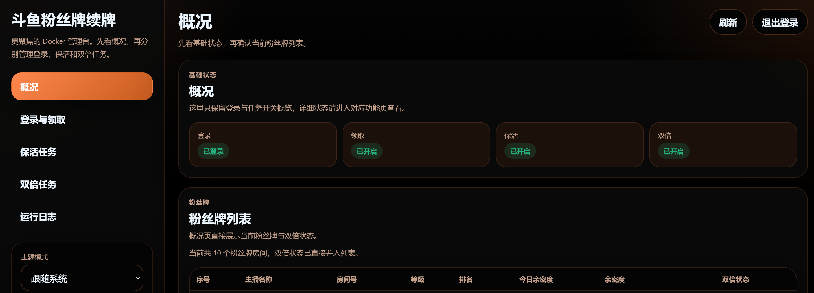

# douyu-keep-just-works

> 一个给斗鱼粉丝牌保活、荧光棒领取和双倍卡处理准备的工具。
>
> 核心理念：It just works.

[下载 Releases](https://github.com/tophtab/douyu-keep-just-works/releases)

**原作者**: Curtion  
**共同维护**: tophtab




## 功能一览

- 支持开机自启，送完自动收工
- 支持常驻运行，按 cron 定时保活
- 支持按固定数量分配保活荧光棒，并支持双倍任务按权重重分配
- 支持独立领取任务，不再偷偷夹带在其他流程前面
- 支持双倍亲密度检测，并按勾选房间参与赠送
- 支持 Windows、macOS，以及适合 NAS / 服务器的 Docker WebUI 版

## Why it just works?

取自 Todd Howard 那句著名的 `It just works.`。

放到这个项目里，意思也很直接：代码很多是 AI 生成的，能跑就行。

## Docker 部署

适用于 NAS、服务器和一切“我不想专门开桌面 GUI，只想它安静工作”的环境。

直接启动容器，首次进入 WebUI 再填写配置就行，不需要先手搓配置文件。
当前 Dockerfile 会在镜像构建阶段自动编译 Docker 运行时代码，不需要额外手动执行 `npm run build:docker`。

### docker-compose.yml

```yaml
services:
  douyu-keep-just-works:
    image: tophtab/douyu-keep-just-works:latest
    container_name: douyu-keep-just-works
    restart: unless-stopped
    ports:
      - '51417:51417'
    volumes:
      - ./config:/app/config
    environment:
      - TZ=Asia/Shanghai
      - WEB_PASSWORD=password
```

### 启动

```bash
docker compose up -d
```

启动后打开 `http://localhost:51417`，先输入 WebUI 密码，再通过管理台填写配置、查看日志和手动触发任务。

查看日志：

```bash
docker compose logs -f
```

## 配置说明

| 字段 | 说明 |
|------|------|
| `cookie` | 斗鱼登录 cookie，需包含 `acf_uid`、`dy_did`、`acf_stk` 等字段 |
| `ui.themeMode` | WebUI 主题模式：`light`、`dark`、`system` |
| `collectGift.active` | 是否启用领取任务；关闭后保留 cron 配置，但不会参与调度 |
| `collectGift.cron` | 领取任务 cron（6 位，含秒），默认 `0 10 0,1 * * *`，表示每天 00:10 和 01:10 各尝试一次 |
| `keepalive.active` | 是否启用保活任务；关闭后保留房间配置与 cron，但不会参与调度 |
| `keepalive.cron` | 保活任务 cron（6 位，含秒），默认 `0 0 8 */6 * *`，表示每 6 天的 08:00 执行一次 |
| `doubleCard.active` | 是否启用双倍任务；关闭后保留勾选和分配设置，但不会参与调度 |
| `doubleCard.cron` | 双倍检测 cron，默认 `0 20 14,17,20,23 * * *`，表示每天 14:20、17:20、20:20、23:20 执行 |
| `keepalive.model` | 保活分配模式：`1` 按百分比，`2` 按固定数量；保活默认固定数量，只有一个房间可配置 `number: -1` 表示领取剩余全部，未配置 `-1` 时多余荧光棒会保留 |
| `doubleCard.model` | 双倍分配模式：`1` 按权重，`2` 按固定数量；按权重时不要求总和等于 `100` |
| `send` | 房间配置，key 为房间号；`model = 1` 时内部使用 `weight` 字段存储权重值 |
| `doubleCard.enabled` | `true` 表示该房间会参与双倍检测与赠送候选集 |

### Docker 环境变量

| 字段 | 说明 |
|------|------|
| `WEB_PASSWORD` | Docker WebUI 登录密码，默认示例值为 `password` |
| `TZ` | 容器时区，建议保持 `Asia/Shanghai` |

### 双倍任务按权重是怎么分的

双倍任务的“按权重”不是传统意义上“先把 100% 填满再送”，而是更接近权重分配：

- 没有房间开双倍：本次不送，留到下次
- 只有 1 个房间开双倍：本次全部送给这个房间
- 有多个房间开双倍：只在这些正在开双倍的房间里，按你填写的权重值重新分配

例如你填的是：

- 房间 A: `1`
- 房间 B: `2`
- 房间 C: `3`

如果这三个房间此刻都开双倍，那么本次会按 `1:2:3` 分，约等于 `16.7% / 33.3% / 50%`。  
如果其中只有 A 和 C 开双倍，那么就只在它们之间按 `1:3` 重新分，B 这次不会参与。

## WebUI 管理面板

Docker 版内置 Web 管理面板，支持：

- 概览页直接查看登录、领取、保活、双倍等状态
- 左侧栏目拆分为概览、登录与领取、保活任务、双倍任务、运行日志
- 领取任务拥有独立 cron、独立状态和单独手动触发入口
- 保活与双倍围绕同一份粉丝牌列表自动同步
- 粉丝牌增减时，保活配置自动补位，不再手动抄配置
- 关闭保活或双倍开关时仅停用调度，保留用户上次保存的配置
- 双倍任务支持按房间勾选并持久化
- 双倍任务支持按权重预览、快速平均分配，以及按粉丝牌等级快速填充权重
- 每个任务页展示 cron 未来三次执行时间
- 页面时间与 Docker 调度统一使用 `Asia/Shanghai`
- 支持浅色、深色和跟随系统主题
- 支持 WebUI 密码登录
- 支持实时日志查看与手动触发任务

## 开发

升级依赖时使用 `yarn up`。`chalk` 禁止升级，保持 `4.1.2`。

### 通用开发

1. `yarn` 或 `npm` 安装依赖
2. `yarn dev` 或 `npm run dev` 进入开发模式

## 打包

1. `yarn build:win` 或 `npm run build:win`
2. `yarn build:mac` 或 `npm run build:mac`
3. `yarn build:linux` 或 `npm run build:linux`
