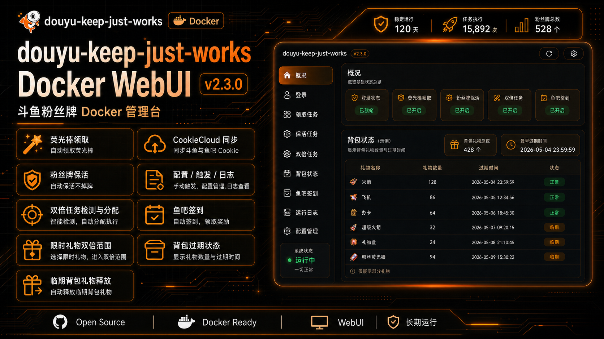

# douyu-keep-just-works

> 斗鱼粉丝牌 Docker 管理台

[Docker 部署](#docker-部署) · [配置说明](#配置说明) · [配置建议](#配置建议)

## 简介



当前仓库主要维护 Docker WebUI，适合 NAS、家庭服务器和长期后台运行场景。

当前支持：

- 荧光棒领取
- 粉丝牌保活
- 双倍任务检测与分配
- 鱼吧签到
- CookieCloud 同步斗鱼相关 Cookie

## Docker 部署

默认部署使用 GitHub Workflow 发布到 Docker Hub 的镜像。

```yaml
services:
  douyu-keep-just-works:
    image: tophtab/douyu-keep-just-works:latest
    container_name: douyu-keep-just-works
    restart: unless-stopped
    ports:
      - '51417:51417'
    volumes:
      - ./config:/app/config
    environment:
      - TZ=Asia/Shanghai
      - WEB_PASSWORD=password
```

```bash
docker compose up -d
```

启动后访问 `http://localhost:51417`，输入 WebUI 密码后即可在页面中保存 Cookie、启用任务、查看日志和手动触发任务。

查看日志：

```bash
docker compose logs -f
```

## 本地 Docker 测试

GitHub Workflow 是标准构建入口，最终会通过仓库根目录的 `Dockerfile` 构建并推送镜像。本地测试使用 `Makefile` 复现同一条 buildx 构建路径：

```bash
make docker-check
make docker-build
make docker-up
```

默认本地镜像 tag 是 `tophtab/douyu-keep-just-works:local`。如需测试其它 tag：

```bash
make docker-build TAG=test
make docker-up TAG=test
```

查看本地测试容器日志：

```bash
make docker-logs
```

停止本地测试容器：

```bash
make docker-down
```


## 配置说明

当前推荐优先通过 WebUI 维护配置，`config.example.json` 仅作为参考。

### 主要字段

| 字段 | 说明 |
|------|------|
| `manualCookies.main` | 主站登录 Cookie，通常来自 `www.douyu.com` 或 `douyu.com` |
| `manualCookies.yuba` | 鱼吧登录 Cookie，通常来自 `yuba.douyu.com` |
| `cookieCloud.active` | 是否启用 CookieCloud |
| `cookieCloud.endpoint` | CookieCloud 服务地址 |
| `cookieCloud.uuid` | CookieCloud 用户标识 |
| `cookieCloud.password` | CookieCloud 端对端加密密码 |
| `cookieCloud.cryptoType` | CookieCloud 加密算法，当前固定为 `legacy` |
| `ui.themeMode` | WebUI 主题模式：`light`、`dark`、`system` |
| `collectGift.active` | 是否启用领取任务 |
| `collectGift.cron` | 领取任务 cron（6 位，含秒） |
| `keepalive.active` | 是否启用保活任务 |
| `keepalive.cron` | 保活任务 cron（6 位，含秒） |
| `keepalive.model` | 保活分配模式：`1` 按百分比，`2` 按固定数量 |
| `keepalive.send` | 保活房间配置，key 为房间号 |
| `doubleCard.active` | 是否启用双倍任务 |
| `doubleCard.cron` | 双倍任务 cron（6 位，含秒） |
| `doubleCard.model` | 双倍分配模式：`1` 按权重，`2` 按固定数量 |
| `doubleCard.enabled` | 房间是否参与双倍检测与赠送 |
| `doubleCard.send` | 双倍房间配置，key 为房间号 |
| `yubaCheckIn.active` | 是否启用鱼吧签到任务 |
| `yubaCheckIn.cron` | 鱼吧签到 cron（6 位，含秒） |
| `yubaCheckIn.mode` | 当前支持 `followed`，表示签到全部已关注鱼吧 |

### Docker 环境变量

| 字段 | 说明 |
|------|------|
| `WEB_PASSWORD` | Docker WebUI 登录密码 |
| `TZ` | 容器时区，建议保持 `Asia/Shanghai` |
| `WEB_PORT` | WebUI 监听端口，默认 `51417` |
| `CONFIG_PATH` | 配置文件路径，默认 `/app/config/config.json` |

## 配置建议

- 推荐优先使用 CookieCloud，同步浏览器里斗鱼相关域的完整 Cookie 集
- 手填 Cookie 只作为兜底，适合临时修复登录态
- 如果鱼吧签到失败，先检查鱼吧 Cookie 是否仍包含 `acf_yb_t`
- 如果主站任务异常，优先检查主站 Cookie 是否仍包含 `acf_uid`、`dy_did`、`acf_stk`

## 项目历史

本项目最初基于 Curtion 的相关实现演进而来，当前只维护 Docker WebUI 方向。
